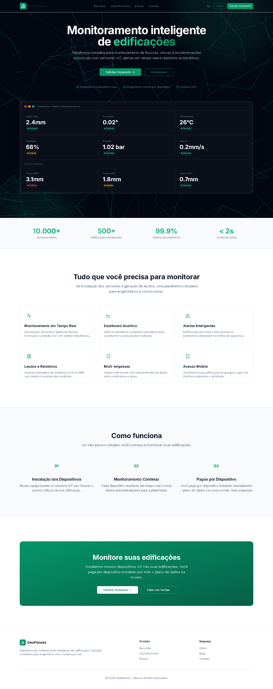

# GeoFissura

**Monitoramento inteligente de edificações.**

Plataforma SaaS para monitoramento de fissuras, trincas e movimentações estruturais com sensores IoT, alertas em tempo real e relatórios automáticos.

## Stack

| Camada | Tecnologia |
|--------|-----------|
| **Framework** | Next.js 14 (App Router) |
| **Linguagem** | TypeScript (strict) |
| **Estilo** | Tailwind CSS + shadcn/ui |
| **Banco** | PostgreSQL (Neon) |
| **ORM** | Drizzle ORM |
| **Auth** | NextAuth v4 (Credentials + JWT) |
| **3D** | Three.js |
| **Deploy** | Vercel |

## Funcionalidades

- [x] **Landing page** — hero com animação Three.js, features, como funciona, CTA
- [x] **Autenticação** — login com email/senha, sessão JWT com clienteId + role
- [x] **Multi-cliente** — isolamento total de dados por cliente
- [x] **CRUD Edificações** — listar, criar, detalhe (editar/deletar em breve)
- [x] **CRUD Sensores** — listar, criar, detalhe (modelo extensível via JSONB)
- [x] **Leituras** — listagem com dados dos sensores IoT
- [x] **Relatórios** — geração de PDF
- [x] **Webhook MQTT** — recebe dados dos dispositivos via EMQX
- [ ] **Dashboard com gráficos** — Recharts
- [x] **CRUD completo** — editar/deletar edificações e sensores
- [ ] **Administração** — gerenciamento de usuários do cliente
- [x] **Upload de laudos** — links com descrição + usuário (Google Drive, etc)
- [ ] **Notificações** — email/SMS para alertas

## Modelo de Negócio

Dispositivos IoT instalados **in loco** nas edificações do cliente. Pagamento mensal por dispositivo + plano de dados na nuvem.

## Começando

```bash
# clonar
git clone https://github.com/devtiagoabreu/geofissura.git
cd geofissura

# instalar
pnpm install

# configurar variáveis de ambiente
cp .env.example .env
# preencha DATABASE_URL, NEXTAUTH_SECRET, NEXTAUTH_URL

# rodar migrations
node scripts/migrate.js

# povoar banco
node scripts/seed.js

# iniciar dev
pnpm dev
```

## Credenciais de Teste

| Papel | Email | Senha |
|-------|-------|-------|
| Super Admin | admin@geofissuras.com | admin123 |
| Usuário Teste | user@geofissura.com.br | 123456 |

## Estrutura

```
src/
├── app/
│   ├── (auth)/login/        # Página de login
│   ├── (dashboard)/         # Painel protegido
│   │   ├── dashboard/       # Home do painel
│   │   ├── edificacoes/     # CRUD edificações
│   │   ├── sensores/        # CRUD sensores
│   │   ├── leituras/        # Listagem de leituras
│   │   ├── relatorios/      # Geração de relatórios
│   │   └── admin/           # Administração
│   ├── api/
│   │   ├── auth/            # NextAuth
│   │   ├── edificacoes/     # API CRUD
│   │   ├── sensores/        # API CRUD
│   │   ├── leituras/        # API leituras
│   │   └── mqtt/webhook/    # Webhook EMQX
│   └── page.tsx             # Landing page
├── components/
│   ├── landing/             # Componentes da landing
│   ├── layout/              # Sidebar, Header, Shell
│   └── ui/                  # shadcn/ui primitives
└── lib/
    ├── db/
    │   ├── schema/          # Drizzle ORM schemas
    │   └── migrations/      # SQL migrations
    └── auth.ts              # NextAuth config
```

## Licença

MIT
